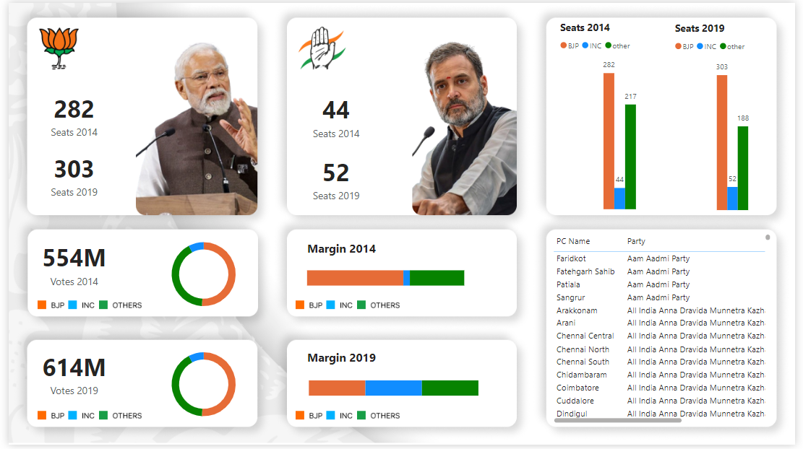

# Lok Sabha Election Results Dashboard🚀

## Project Overview 📊
I analyzed the Lok Sabha election results for the years 2014 and 2019, cleaned the datasets, and developed an interactive dashboard as part of my portfolio project. This project showcases my ability to handle large datasets, perform data cleaning, and create insightful visualizations.

## Technologies Used 🔧
- **Dataset:** Lok Sabha election results from 2014 and 2019
- **Data Transformation:** Power BI (utilizing various power queries)
- **Design:** Figma
- **Visualization:** Power BI

## Project Details 📈
- **Data Cleaning:** Processed and cleaned raw election data to ensure accuracy and consistency.
- **Data Analysis:** Conducted in-depth analysis to uncover trends and insights from the Lok Sabha election results.
- **Dashboard Design:** Designed an intuitive and visually appealing dashboard using Figma, and implemented it in Power BI.
- **Visualization:** Created various visualizations to represent the election data effectively, making it easy to interpret and analyze.

